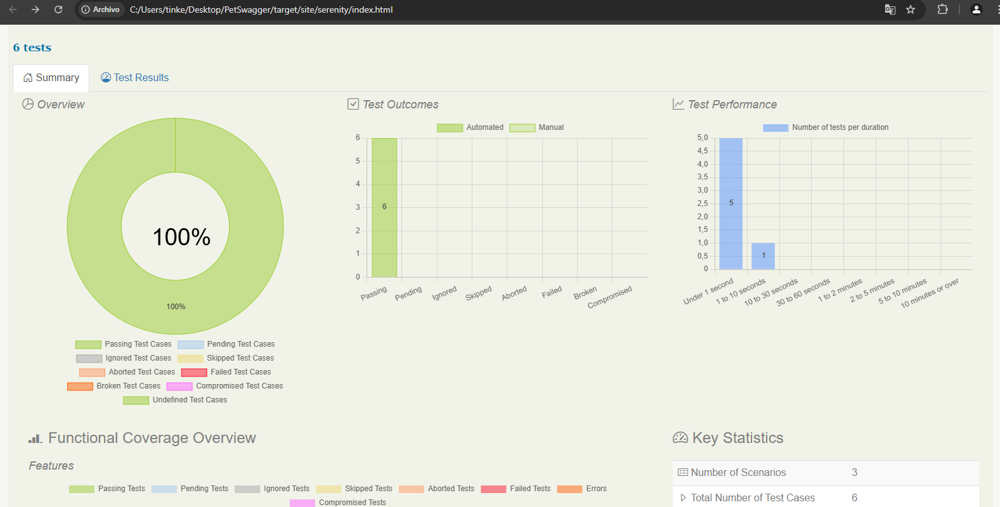

# Proyecto de Automatización de Pruebas - Swagger Petstore

Este proyecto tiene como objetivo la automatización de pruebas para la creación, consulta y actualización de mascotas en **Swagger Petstore** (https://petstore.swagger.io/#/pet/addPet), utilizando **Cucumber**, **Serenity BDD** y **RestAssured**. Se implementan pruebas para validar las operaciones relacionadas con el manejo de mascotas en la API REST.

## Tecnologías Utilizadas

- **Java**: Lenguaje de programación utilizado para desarrollar las pruebas.
- **RestAssured**: Librería para facilitar pruebas automáticas de servicios RESTful.
- **Cucumber**: Framework para la escritura de pruebas en lenguaje natural (Gherkin).
- **Serenity BDD**: Biblioteca para la gestión de pruebas y generación de reportes.
- **JUnit**: Framework de pruebas unitarias para Java.

## Funcionalidades Implementadas

- **Creación de Mascotas**: Pruebas automatizadas para validar el proceso de añadir nuevas mascotas a través del endpoint de creación.
- **Consulta de Mascotas**: Pruebas que verifican la consulta de mascotas por ID para asegurar que se recuperan los datos correctamente.
- **Actualización de Mascotas**: Pruebas para actualizar los datos de las mascotas existentes utilizando el método PUT.
- **Validación de Respuestas**: Se valida la estructura de las respuestas, el código de estado de la API y los datos retornados por la API.
- **Pruebas de Regresión**: Se implementan pruebas para garantizar que nuevas funcionalidades o cambios no afecten la funcionalidad existente.
- **Uso de Gherkin**: Los escenarios de prueba se escriben en lenguaje natural para facilitar la comprensión del comportamiento de la API.
- **Control de Versiones con Git**: Todo el código está versionado utilizando Git y hospedado en GitHub.

## Procedimientos

1. **Instalación**:
   - Asegúrate de tener instalado Java JDK y Maven en tu máquina.
   - Clona el repositorio:
     ```bash
     git clone https://github.com/Emihucar/ExamenPetSwagger
     ```
   - Navega al directorio del proyecto:
     ```bash
     cd ExamenPetSwagger
     ```

2. **Ejecución de Pruebas**:
   - Para ejecutar las pruebas, utiliza el siguiente comando:
     ```bash
     mvn clean verify
     ```
   - Esto compilará el proyecto y ejecutará las pruebas definidas.

3. **Generación de Reportes**:
   - Los reportes generados por Serenity se pueden encontrar en el directorio `target/site/serenity` para ver los resultados de las pruebas.

4. **Contribuciones**:
   - Si deseas contribuir al proyecto, siéntete libre de abrir un `issue` o enviar un `pull request`. Asegúrate de seguir las mejores prácticas de codificación.

## Capturas de Pantalla


